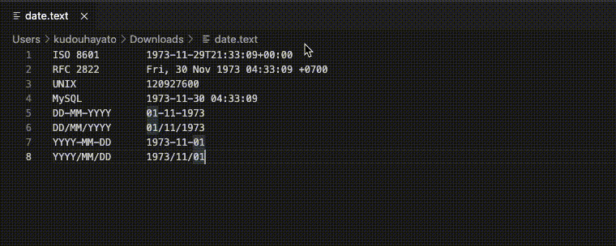

# Date Conversion

Converts the focused IOS, RFC, unixtime, and other date standards to the following

1. date string
2. string according to the local date format
3. UNIX time



### Supported formats
```
ISO 8601		1973-11-29T21:33:09+00:00
RFC 2822		Fri, 30 Nov 1973 04:33:09 +0700
UNIX            120927600
MySQL		    1973-11-30 04:33:09
DD-MM-YYYY		01-11-1973
DD/MM/YYYY		01/11/1973
YYYY-MM-DD		1973-11-01
YYYY/MM/DD		1973/11/01
```

### Change local


local refers to the display language set in vscode.

Press ⇧⌘P to bring up the Command Palette then start typing "display" to filter and display the Configure Display Language command.


Press Enter and a list of installed languages by locale is displayed, with the current locale highlighted.

